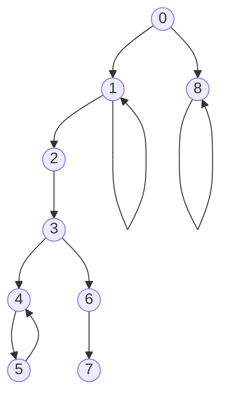

# Examples

本目录下的不同子目录中实现了不同游戏规则下的几种 `GameGraphPositionBase` 的子类实现。通过 make 的 `ID` 参数可以指定要编译哪个子目录下的示例。例如要编译 `example00` 中的示例，执行：

```bash
make ID=00
```

测试程序会打印该游戏规则下所有的合法局面，以及每个局面的类型，并判断它们是否是死局。

## example00

这不是一个真正的游戏规则，而是一个人为构造的图（如下图所示），是在最初用于测试我的图染色算法的样例之一。



## example01

游戏规则：两个玩家从 $1$ 开始轮流按顺序报数，每次可以报不少于一个不多于 $N$ 个连续的数，谁先报到 $M$ 就获胜。

这是一个经典的小学奥数问题，它的结论是：如果 $M \bmod (N+1) = 0$，后手必胜；否则先手必胜。

在本项目的语境下，我们称当前局面为 $x$，指本回合会行动玩家将从 $x$ 开始报数。规定游戏终局为 $M+1$。局面 $x$ 的所有后继局面是 $\{y|y = x+k,k \in [1,N], y \leq M+1\}$。显然，这是一个 DAG，因此每种局面一定是 P-Position 或 N-Position；具体地：若 $(M+1-x) \bmod (N+1) = 0$，则 $x$ 是 P-Position；否则 $x$ 是 N-Position。

注意这里规定 $M+1$ 为游戏终局，而非 $M$——游戏终局是指玩家无法行动的局面，而若玩家处于局面 $M$，则他仍可行动（并取得胜利）。

## example02

游戏规则：两个玩家各自维护两个整数，初始时两个整数都为 $1$。每回合行动玩家选择自己手上一个数 $a$ 和对手手上一个数 $b$（满足 $a > 0, b > 0$），并将 $a$ 替换为 $(a+b) \bmod 10$。谁先使自己手上的数都为 $0$ 就获胜。

这个游戏在我上小学时非常流行，几乎是我们这代人的童年记忆。事实上这个项目最早也是为了这个游戏而写的——当时我正陪 sageblue 乘坐 1h 的地铁前往他的学校，为了帮他就他的期末成绩找老师申诉。路上百无聊赖的我们玩起了这个游戏，这时候 sageblue 突然问我，这个游戏是否存在必胜策略。

设计 `Position` 类（派生自 `GameGraphPositionBase`）的朴素方法是：定义两个无序对分别表示游戏双方的状态，然后定义成员 `Turn` 表示本回合行动方。但这样会增添大量重复的局面，从而造成浪费，因为按照定义，我们不关心当前局面谁是先手，我们只关系先手玩家和后手玩家各自的状态。例如，局面 $Alice={0,1}, Bob={9,9}, Turn=Alice$ 和局面 $Alice={9,9}, Bob={0，1}, Turn=Bob$ 完全可以视作相同的局面，即 $FirstPlayer={0,1}, SecondPlayer={9,9}$.

因此 `Position` 类的成员变量只需包含两个无序对，分别表示当前局面先手玩家（当前行动方）和后手玩家（下一回合行动方），并在本回合行动后（即 `get_next_positions` 方法）交换两个无序对。

乍一看，可能会觉得这个游戏的局面接近 $10^4$ 种，但去除重复和不可到达的局面后，实际上的合法局面仅有 $2744$ 种。
